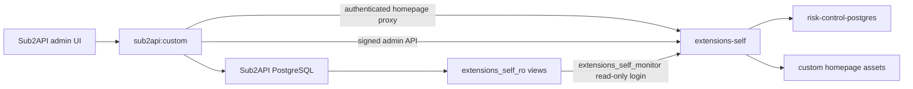

# Extensions-Self Architecture

## Runtime Topology

生产只有一个 `extensions-self` 应用容器和一个 `deploy-extensions-self` 镜像。该进程组合
`risk-control`、账号监控 account monitor 和自定义首页；禁止为账号监控新增第二个应用容器。
`risk-control-postgres` 是独立数据服务和命名卷，发布应用时不得 `up`、`rm` 或 `down` 它。

## Ownership

| 能力 | 主应用 | extensions-self | 数据库 |
|---|---|---|---|
| 管理员身份与合规确认 | 权威来源 | 只接受签名 actor ID | 主库 |
| 用户/账号最终状态 | 权威来源 | 风控只提出/记录操作 | 主库 |
| 风控事件、规则、审计 | 同源签名代理 | 业务所有者 | `risk-control-postgres` |
| 账号尝试、聚合、阈值、重建 | 菜单/路由/代理 | 业务所有者 | `risk-control-postgres` |
| 成功/错误来源数据 | 业务写入 | 只读采集 | 主库 `extensions_self_ro` |
| 账号与分组监控页面 | 原生 Vue、鉴权与同源代理 | 管理 API | 无 |
| 最终请求分组事实 | 写入 `group_id` 来源 | 幂等采集、镜像和 10 分钟聚合 | 主库安全视图 / `risk-control-postgres` |

## Trust Boundaries

1. 浏览器不能直接调用扩展签名 API；主应用先完成管理员鉴权和合规检查。
2. 主应用用 `RISK_CONTROL_INTERNAL_SECRET` 对时间戳、nonce 和请求体做 HMAC 签名。
3. 账号监控源 DSN 只使用 `extensions_self_monitor`。其权限来自不可登录的
   `extensions_self_monitor_ro`，只能 SELECT 安全视图。
4. 页面与事实库不保存完整 API Key、账号凭据、请求体、请求头、OAuth token 或 cookie。
5. 扩展停止、源库不可用或扩展库不可用不能阻塞 Sub2API 主请求链路。

## Release Unit

主应用和 `extensions-self` 必须来自同一批准的 `origin/custom` commit。发布器先验证干净
工作树和 Compose，再备份主库与扩展库，安装/探测安全视图，构建两个镜像，只重建
`sub2api` 与 `extensions-self`，最后检查主应用、首页、原生账号/分组监控页面和签名 API。
发布备份同时包含两个已校验 dump、Compose、`.env`、Nginx、证书、容器/镜像元数据和
匹配回滚 tag。历史数据随后按不超过 31 天的非重叠段回填；任一段失败即停止。

代码完成不等于生产发布。实现 commit、合并、推送、生产备份、发布和回滚是独立状态，
必须分别报告。

2026-07-16 账号与分组监控生产发布的批准提交、镜像、备份、回填和回滚记录见
[`ACCOUNT-MONITOR-RELEASE-2026-07-16.md`](ACCOUNT-MONITOR-RELEASE-2026-07-16.md)。
