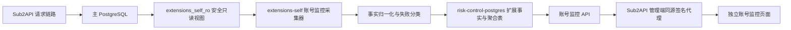

# Extensions-Self 账号监控设计规格

日期：2026-07-15
状态：设计已确认，等待实施计划
目标仓库：`E:\Code\sub2api`
目标分支：从 `custom` 创建独立 feature 分支或 worktree 进行实施

## 1. 文档用途

本文是账号监控功能的完整实施规格，也是新对话的交接入口。新对话必须先完整阅读本文，再读取仓库规则和相关源码，随后使用 `writing-plans` 产出实施计划。本文确认的是设计，不代表代码已经实现或生产已经发布。

实施前必须阅读：

1. `E:\Code\sub2api\AGENTS.md`
2. `E:\Code\sub2api\deploy\RELEASE-RUNBOOK.md`
3. `E:\Code\sub2api\docs\superpowers\specs\2026-07-15-extensions-self-migration-design.md`
4. `E:\Code\sub2api\extensions-self\risk-control\README.md`
5. 本文

## 2. 背景

`extensions-self` 当前由一个 Go 容器承载自定义扩展，已经包含：

- 风控 API 与风控管理能力
- 独立自定义首页
- 主应用同源代理及签名调用

本次新增“账号监控”扩展，用于回答以下问题：

- 每个上游账号实际调用了多少次？
- 成功多少、失败多少、成功率是多少？
- 每个账号的每个实际上游模型调用、成功和失败分别是多少？
- 失败原因有哪些，每种原因出现多少次？
- 哪些用户和 API Key 使用了该账号，各自调用量是多少？
- Token、成本、延迟、图片和视频用量如何？
- 哪些账号、模型或用户出现异常？

核心约束是尽量少修改官方 Sub2API。统计、聚合、异常规则、页面主体和扩展数据表应归属 `extensions-self`。官方代码只保留不可避免的菜单、路由、同源代理和一个用于准确记录失败模型的兼容字段。

## 3. 已核实现状

### 3.1 成功及用量数据

`usage_logs` 已包含：

- `account_id`
- `user_id`
- `api_key_id`
- `request_id`
- `model`
- `requested_model`
- `upstream_model`
- Token、成本、延迟、请求类型、端点、图片及视频字段

现有账号统计接口位于：

- `backend/internal/service/account_usage_service.go`
- `backend/internal/repository/usage_log_repo_stats.go`
- `backend/internal/handler/admin/account_handler.go`
- `frontend/src/components/admin/account/AccountStatsModal.vue`

现有弹窗只基于 `usage_logs` 展示成本、请求、模型、端点和趋势，没有把账号失败、失败原因和用户/API Key 分布统一进来。

当前仓库使用 `actual_cost > 0` 作为可计费成功用量的代理条件，并排除零成本失败占位行。账号监控应复用这一既有口径，不能把失败占位记录重复算成成功。

### 3.2 错误与重试数据

`ops_error_logs` 已包含：

- 用户、API Key、账号、分组
- 请求模型和实际上游模型
- 状态码、上游状态码、错误类型、错误阶段、错误所有者
- 脱敏错误信息
- `upstream_errors` JSON 数组

`upstream_errors` 会记录同一次请求中的多个上游失败尝试，即使后续切换账号后请求最终成功，恢复型失败仍可用于账号健康分析。

现有统一请求明细已经通过 `usage_logs UNION ALL ops_error_logs` 提供成功与错误视图，见：

- `backend/internal/repository/ops_repo_request_details.go`
- `backend/internal/service/ops_request_details.go`

### 3.3 生产数据抽样

2026-07-15 对生产库进行只读抽样：

- 近 7 天 `usage_logs`：8,773 行
- 涉及账号：75 个
- 涉及用户：3 个
- 涉及模型：9 个
- 近 7 天 `ops_error_logs`：488 行
- 最终失败：370 行
- 恢复型或内部上游失败：118 行
- 可归属账号的错误：338 行
- 可归属用户的错误：408 行
- 可识别模型的错误：402 行

这说明现有数据足以支撑功能，但不能把所有错误强行归属账号。认证失败、路由前失败、安全拦截等没有实际调用上游账号，只能计入用户请求结果或“未分配账号”数据质量项。

### 3.4 数据保留差异

仓库默认配置：

- `usage_logs` 明细保留 90 天
- `ops_error_logs` 明细保留 30 天
- Dashboard 小时聚合保留 180 天
- Dashboard 日聚合保留 730 天

因此不能直接用现有原始表计算 30 天以上的账号成功率。账号监控必须在采集后将脱敏错误事实保存到扩展库并保留 90 天；不要求修改主库 `ops_error_logs` 的 30 天保留策略。首次历史回填只能覆盖主库仍存在的数据，缺失范围必须在页面明确标注，不能伪造或外推。

## 4. 已确认的产品决策

1. 模型维度按“实际上游模型”统计。
2. 采用账号尝试和用户最终结果双口径。
3. 明细保留 90 天，日聚合保留 1 年。
4. 做成与风控类似的独立管理页面。
5. 失败原因按稳定中文分类汇总，原始错误只用于脱敏钻取。
6. 用户默认汇总，并支持 API Key 下钻。
7. 首期只做页面内异常标记和可配置阈值，不自动停用账号，不发送外部通知。
8. 汇总数据分钟级更新，最近明细近实时。
9. 物理账号默认分开统计，并支持母账号汇总和影子账号展开。
10. 首期包含 Token、成本和性能指标。
11. 覆盖同步、流式、WebSocket、图片、视频和安全拦截等全部请求类型。
12. 采用“主库安全只读视图 + 扩展库独立聚合”方案。
13. 必须更新代码内文档，使新接手者能快速理解项目用途、扩展目录、数据流和发布方式。

## 5. 统计术语与公式

### 5.1 账号上游尝试

一次真实发往某个上游账号的请求称为一次账号上游尝试。

- 成功尝试：由有效 `usage_logs` 成功记录产生。
- 失败尝试：由 `ops_error_logs.upstream_errors` 中每个账号事件产生。
- 当 `upstream_errors` 为空但错误行具有账号归属和明确上游失败语义时，合成一个失败尝试。
- 当 `upstream_errors` 非空时，不得再用错误行顶层 `account_id` 重复生成失败尝试。

账号尝试总数：

```text
账号尝试总数 = 成功尝试数 + 失败尝试数
账号成功率 = 成功尝试数 / 账号尝试总数
```

### 5.2 用户请求结果

一次客户端请求只产生一个最终结果。

- 最终成功：存在有效成功用量记录。
- 最终失败：存在 `status_code >= 400` 的最终错误，且没有对应最终成功。
- 使用请求标识和 API Key 归属进行去重。
- 没有稳定请求标识时，以来源记录 ID 兜底，并标记数据质量降级。

```text
用户请求总数 = 最终成功数 + 最终失败数
用户最终成功率 = 最终成功数 / 用户请求总数
```

### 5.3 重试示例

```text
用户请求 R1
  账号 A / gpt-5.4 -> 429 失败
  账号 B / gpt-5.4 -> 成功

账号 A：尝试 1，失败 1
账号 B：尝试 1，成功 1
用户请求：最终成功 1
```

### 5.4 实际模型

成功记录模型取值：

```text
upstream_model -> requested_model -> model
```

失败重试事件当前没有独立保存该次尝试的模型。为满足“账号 × 实际模型失败数”的准确性，必须给现有 `OpsUpstreamErrorEvent` JSON 增加可选 `upstream_model` 字段，并在实际发送上游请求时写入映射后的模型。

这是唯一允许深入官方请求链路的必要改动：

- 字段位于现有 JSON 事件，不新增官方数据库表。
- 对历史 JSON 完全向后兼容。
- 历史事件缺少字段时，回退到错误行 `upstream_model -> requested_model -> model`。
- 回退结果必须标记 `model_attribution=estimated`；新事件标记 `exact`。

## 6. 总体架构



账号监控采集器、聚合器、API 和页面资源都运行在现有 `extensions-self` 容器内。扩展停止、采集失败或扩展数据库不可用不得阻塞 Sub2API 请求链路。

## 7. 主库安全只读层

不得直接把生产 Sub2API 数据库写权限交给扩展。部署时在主数据库创建专用 schema、视图和只读角色，例如：

- schema：`extensions_self_ro`
- role：`extensions_self_monitor_ro`

建议视图：

- `extensions_self_ro.usage_source`
- `extensions_self_ro.error_source`
- `extensions_self_ro.account_dimension`
- `extensions_self_ro.user_dimension`
- `extensions_self_ro.api_key_dimension`

视图只暴露统计所需字段。明确禁止暴露：

- `accounts.credentials`
- OAuth Token、Cookie、代理凭据
- 完整 API Key
- 错误请求体和请求头
- 未经脱敏的上游响应体

`error_source` 应在数据库视图中把 `upstream_errors` 转换为安全 JSON，仅保留：

- 时间
- 平台
- 账号 ID
- 账号显示名
- 实际模型
- 上游状态码
- 事件类型
- 脱敏后的简短错误信息

API Key 视图可计算固定长度前缀，但扩展角色不能读取完整 key 列。

只读视图和角色的 SQL 归属 `extensions-self/account-monitor/sql/`，不加入官方 Sub2API migration runner，降低上游同步冲突。

## 8. 扩展模块边界

在 `extensions-self` 内新增独立 `account-monitor` 模块。建议职责拆分：

- `source`：只读主库查询与安全视图契约。
- `collector`：增量同步、回看窗口和游标。
- `normalizer`：账号尝试与用户结果事实生成。
- `classifier`：中文失败原因归类。
- `aggregate`：分钟和日聚合。
- `anomaly`：异常阈值与原因生成。
- `repository`：扩展数据库读写。
- `admin`：管理员 API。
- `web`：账号监控页面静态资源。

风控与账号监控共享进程、HTTP 服务和数据库连接池，但业务包、表名、路由前缀和测试必须分开。

## 9. 同步与幂等

### 9.1 增量同步

- 每分钟读取一次主库新增数据。
- 每次同步回看最近 5 分钟，处理异步晚到错误。
- 成功日志和错误日志分别保存高水位游标。
- 游标只在整批事实和聚合更新成功后推进。
- 同步失败使用有上限的指数退避。

### 9.2 幂等键

建议事件键：

```text
成功尝试：usage:<usage_log_id>
失败尝试：ops:<ops_error_log_id>:event:<event_index>
合成失败：ops:<ops_error_log_id>:synthetic
用户结果：request:<api_key_id>:<request_id>
```

缺失稳定请求标识时使用来源行 ID，并记录 `identity_quality=fallback`。

### 9.3 重建

- 管理员可提交指定时间范围的重建任务。
- 单次范围不得超过 31 天，较大范围拆批。
- 同一时间范围使用任务锁，禁止并发重复重建。
- 重建使用 upsert，不先清空整表。
- 页面显示任务进度、处理行数、错误和完成时间。

## 10. 扩展数据库建议

以下为逻辑表名，实施计划可在不改变职责的前提下调整命名：

### 10.1 明细事实表

`account_monitor_attempt_facts`：账号上游尝试，保留 90 天。

核心字段：

- `event_key`
- `request_key`
- `attempted_at`
- `account_id`
- `parent_account_id`
- `platform`
- `actual_model`
- `model_attribution`
- `user_id`
- `api_key_id`
- `request_type`
- `result`
- `recovered`
- `error_category`
- `status_code`
- `upstream_status_code`
- `provider_error_code`
- `tokens`
- `user_cost`
- `account_cost`
- `duration_ms`
- 图片和视频专项字段

`account_monitor_request_facts`：用户最终请求结果，保留 90 天。

### 10.2 聚合表

- `account_monitor_account_minute`
- `account_monitor_account_model_minute`
- `account_monitor_account_daily`
- `account_monitor_account_model_daily`
- `account_monitor_account_user_daily`
- `account_monitor_account_error_daily`

分钟聚合保留 90 天，日聚合保留 1 年。

### 10.3 控制表

- `account_monitor_sync_state`
- `account_monitor_rebuild_jobs`
- `account_monitor_thresholds`

不得在扩展库复制账号凭据、完整 API Key、请求体或请求头。用户邮箱和账号名称优先从安全维度视图实时读取；聚合表只保存 ID，已删除实体显示为“已删除用户/账号（ID）”。

## 11. 失败原因归类

一级中文分类：

- 限流
- 上游过载
- 账号认证失效
- 账号额度不足
- 模型不可用
- 网络连接失败
- 请求超时
- 上游服务错误
- 请求参数错误
- 内容或安全拦截
- 无可用账号
- 未知错误

分类依据按稳定性排序：

1. 明确的 provider error code/type
2. 上游状态码
3. `error_type` 和 `error_phase`
4. 网络错误类型
5. 已脱敏错误文本模式
6. 未知错误兜底

一级分类用于统计；HTTP 状态码、上游错误码和原始 `error_type` 作为二级维度。脱敏原始错误只在请求明细中展示。

## 12. 页面设计

账号监控作为独立管理入口，体验参照风控页面。为了减少官方前端改动，页面主体由 `extensions-self` 提供，并通过主应用同源代理加载；官方前端只保留菜单、路由和薄页面壳。

### 12.1 顶部总览

- 账号尝试总数、成功、失败、成功率
- 用户最终请求数、最终成功率
- 活跃账号、异常账号、调用用户数
- Token 总量、用户计费、账号成本
- 平均响应时间、P95 响应时间
- 最近同步时间和同步延迟

### 12.2 筛选

- 今天、24 小时、7 天、30 天、90 天、自定义时间
- 平台、账号、母账号、账号状态
- 实际上游模型
- 用户、API Key
- 请求类型
- 成功/失败
- 中文失败原因、状态码
- 物理账号/母账号汇总模式

### 12.3 账号列表

- 账号名称、ID、平台、状态、母子关系
- 调用、成功、失败、成功率
- 实际模型数、调用用户数
- Token、用户计费、账号成本
- 平均/P95 延迟
- 最近成功、最近失败
- 异常状态和直白原因

所有筛选、排序和分页必须服务端执行。每页支持 20、50、100 条。

### 12.4 账号详情

详情抽屉包含：

1. 模型统计
2. 用户统计与 API Key 下钻
3. 失败原因
4. 趋势
5. 最近调用和重试链
6. 图片/视频专项指标

模型表必须按实际上游模型显示调用、成功、失败、成功率、Token、成本和延迟。用户表账号标识优先显示邮箱，用户名为辅助信息；API Key 只显示名称、ID和脱敏前缀。

### 12.5 刷新

- 页面默认每 60 秒刷新。
- 提供手动刷新。
- 自动刷新不得清空筛选、分页、选择项或当前抽屉。
- 明细使用最新原始事实，汇总使用分钟聚合。

## 13. 请求类型

首期覆盖：

- 同步请求
- 流式请求
- WebSocket 请求
- 图片生成
- 视频生成
- 安全策略拦截

安全策略在分配账号前拦截时，只计入用户最终结果，不计入账号失败。图片额外统计生成数量和尺寸；视频额外统计生成数量、分辨率和时长。

## 14. 异常规则

健康状态：正常、关注、异常、严重。

默认规则：

- 近 1 小时至少 20 次调用且成功率低于 90%：异常。
- 同一实际模型连续失败 5 次：异常。
- 15 分钟内认证失效或额度不足达到 3 次：严重。
- 15 分钟内 429 或 529 占比超过 30%：关注。
- 活跃账号连续 30 分钟没有成功调用：关注。
- 单用户占账号近 24 小时调用量超过 70%，且总调用至少 100 次：关注。
- 当前小时调用量高于近 7 天同时间均值 3 倍或低于 20%：流量异常。
- P95 延迟高于近 7 天基线 2 倍：性能异常。

规则支持全局、平台、母账号和单账号覆盖。优先级：单账号 > 母账号 > 平台 > 全局。

异常必须显示依据，例如：

```text
近 1 小时调用 82 次，失败 19 次，成功率 76.8%，低于 90% 阈值；主要原因：上游限流 12 次。
```

首期不自动停用账号，不发送邮件或钉钉。

## 15. 数据质量

页面必须显示：

- 最近同步时间和延迟
- 主库只读连接状态
- 成功和错误游标
- 错误账号归属率
- 无法归属账号的失败数
- 恢复型失败数
- 精确/估算模型归属数量
- 缺失请求标识数量
- 跳过监控规则和错误日志队列丢弃造成的潜在缺失
- 当前时间范围使用明细还是聚合

数据不可用时不得显示为 0，必须显示“暂不可用”以及原因。

## 16. API 设计

建议路由前缀：`/api/v1/admin/extensions-self/account-monitor`。

- `GET /overview`
- `GET /accounts`
- `GET /accounts/:id`
- `GET /accounts/:id/models`
- `GET /accounts/:id/users`
- `GET /accounts/:id/errors`
- `GET /attempts`
- `GET /data-quality`
- `GET /thresholds`
- `PUT /thresholds`
- `POST /rebuild-jobs`
- `GET /rebuild-jobs/:id`

浏览器请求先经过 Sub2API 管理员鉴权，再由主应用使用现有扩展签名机制代理到 `extensions-self`。扩展内部端口不对公网暴露。

列表接口必须：

- 限定时间范围
- 服务端分页
- 白名单排序
- 查询超时
- 最大页大小 100
- 返回稳定总数和数据质量信息

## 17. 官方代码改动预算

允许修改：

- 管理菜单入口
- 一个前端路由和薄页面壳
- 同源静态页面代理
- 管理 API 代理白名单
- 必要 i18n
- Compose/环境变量和发布文档
- `OpsUpstreamErrorEvent.upstream_model` 及实际尝试写入点

不允许把以下内容放入官方模块：

- 账号监控统计表
- 聚合定时任务
- 失败归类规则
- 阈值配置
- 重建任务
- 账号监控业务 API
- 页面主体

实施计划必须列出所有官方文件改动，并说明为什么不可避免。完成后应单独检查与 `upstream/main` 的冲突面。

## 18. 故障处理

- 主库不可用：保留旧结果，显示延迟，后台退避重试。
- 扩展库不可用：API 返回明确错误，不影响主应用和风控请求。
- 同步批次失败：事务回滚，游标不推进。
- 重复数据：幂等 upsert。
- 晚到数据：5 分钟回看窗口。
- 长时间停机：从游标继续；超过保留期则提示缺口。
- 重建失败：保留旧聚合，记录任务错误和可重试状态。
- 查询超时：只终止当前查询，不触发全局重建。

## 19. 测试要求

### 19.1 单元测试

- 成功、最终失败、重试后成功、多账号连续失败
- 实际模型字段和历史回退
- 中文错误归类
- 用户/API Key/母子账号聚合
- 请求去重和事件幂等
- 阈值继承和异常原因

### 19.2 集成测试

- 主库安全视图权限
- PostgreSQL 增量同步
- 晚到日志和游标恢复
- 重复同步不重复计数
- 90 天明细清理和 1 年日聚合保留
- 聚合重建与并发任务锁
- 大数据量查询计划和索引命中

### 19.3 API 与安全测试

- 管理员鉴权
- 扩展签名
- 非管理员拒绝
- 完整 key、凭据、请求体和请求头不出现在响应
- 分页、排序、筛选和最大时间范围

### 19.4 浏览器测试

- 桌面 1440x900
- 移动 390x844
- 页面非空、无框架错误、无控制台错误
- 筛选、排序、分页、抽屉、API Key 展开、异常详情、重建任务
- 无横向溢出、按钮重叠或嵌套滚动陷阱
- 自动刷新保留页面状态

### 19.5 对账

使用生产只读 SQL 抽样核对账号、实际模型、用户、失败原因和恢复型失败。允许明确记录的日志缺失，不允许公式或去重错误。

## 20. 发布顺序

1. 从 `custom` 创建独立 feature worktree。
2. 备份扩展数据库、Compose、环境变量和发布脚本。
3. 创建主库安全只读 schema、视图和角色。
4. 发布扩展数据库迁移和采集器，暂不开放页面入口。
5. 回填最近 90 天可用明细；错误历史只按主库现存范围回填，不伪造缺失记录。
6. 生成可用历史范围内的日聚合。
7. 抽样对账并核对数据质量。
8. 开启分钟同步和异常计算。
9. 最后发布官方薄路由、菜单、代理和失败模型字段。
10. 桌面和移动浏览器验收后开放入口。

发布必须保护：

- `risk-control-postgres` 容器和数据卷
- 现有风控 API
- 自定义首页
- `extensions-self` 单容器约束
- 上游同步与发布脚本

## 21. 回滚

- 关闭账号监控菜单入口和采集器。
- 回滚 `sub2api` 与 `extensions-self` 到匹配镜像。
- 不删除扩展聚合表，保留用于诊断和重新发布。
- 主库只读角色和视图可保留；若必须删除，先确认没有其他扩展使用。
- 不触碰主库业务数据、风控数据卷或首页配置。

## 22. 文档交付要求

实现时必须同步更新：

1. `extensions-self/README.md`
   - 项目用途
   - 当前扩展功能目录
   - 单容器架构
   - 快速接手入口
2. `extensions-self/risk-control/README.md`
   - 风控职责和边界
3. `extensions-self/account-monitor/README.md`
   - 统计口径
   - 数据源、表、API、配置和任务
   - 限制与数据质量
4. 扩展架构文档
   - 主应用、扩展容器、主库、扩展库和代理链路
5. 数据字典
   - 账号尝试、用户结果、恢复型失败、实际模型、精确/估算
6. 部署、回滚、重建和故障排查手册
7. 环境变量示例
8. `AGENTS.md`
9. `deploy/RELEASE-RUNBOOK.md`
10. VPS 运维文档中的 Sub2API 服务架构和固定目录
11. 新增扩展检查清单

任何功能改动如果改变扩展模块、端口、数据库、路由、环境变量、发布顺序或回滚方式，都必须在同一提交系列中更新文档。

## 23. 验收标准

功能验收：

- 可按账号查看总调用、成功、失败和成功率。
- 可按账号和实际上游模型查看调用、成功和失败。
- 可查看中文失败原因及次数。
- 可查看使用账号的用户和 API Key 调用量。
- 可区分账号尝试与用户最终结果。
- 可正确统计重试后成功。
- 可查看 Token、成本、延迟、图片和视频指标。
- 可按母账号汇总并展开影子账号。
- 异常状态有直白依据。
- 数据质量缺口明确显示。

工程验收：

- 主请求链路不依赖账号监控可用性。
- 扩展只使用安全只读视图。
- 官方代码改动限制在第 17 节预算内。
- 聚合查询不直接全表扫描生产原始表。
- 增量同步和重建幂等。
- 90 天明细和 1 年日聚合保留策略生效。
- 风控、首页和上游同步链路不回归。
- 文档足以让新接手者说明项目、扩展、数据流、发布和回滚。

## 24. 非目标

首期不包括：

- 自动停用或封禁上游账号
- 邮件、钉钉或其他外部通知
- 将监控数据用于财务结算
- 保存完整 API Key 或账号凭据
- 保存成功请求体
- 无限期保留原始明细
- 新增第二个扩展容器
- 重构官方账号管理页面

## 25. 新对话执行说明

新对话可直接使用以下指令：

```text
请在 E:\Code\sub2api 继续实施账号监控扩展。

开始前完整阅读：
1. E:\Code\sub2api\AGENTS.md
2. E:\Code\sub2api\deploy\RELEASE-RUNBOOK.md
3. E:\Code\sub2api\docs\superpowers\specs\2026-07-15-account-monitor-design.md
4. E:\Code\sub2api\docs\superpowers\specs\2026-07-15-extensions-self-migration-design.md
5. E:\Code\sub2api\extensions-self\risk-control\README.md

先检查 git 状态、当前分支、远程和现有 worktree。不要直接开始实现，先使用 writing-plans 根据账号监控设计规格产出详细实施计划，并将任务拆成可验证的小步骤。实现主体必须放在 extensions-self，尽量少改官方 Sub2API；不得破坏风控、首页、risk-control-postgres、上游同步和发布链路。先测试后实现，完成后进行桌面和移动浏览器验证。未经当前对话明确授权，不得发布生产。
```
