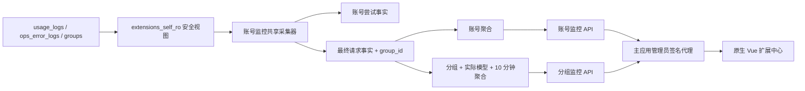

# 扩展中心、账号风险分与分组监控设计

日期：2026-07-15
状态：设计已确认，等待书面规格复核
目标仓库：`E:\Code\sub2api`

## 1. 文档用途

本文定义下一阶段的统一实现范围：

- 将自定义管理功能收口到一个原生 Vue“扩展中心”。
- 将账号监控从 iframe 静态页迁移为原生 Vue 页面。
- 为账号监控增加可解释的 0–100 风险分。
- 新增按业务分组和实际模型展示最终调用状态的分组监控。
- 让账号监控与分组监控复用最终请求事实、采集、回填和数据质量链路。

本文不代表代码已经实现、合并、推送或发布。实施前必须先使用
`writing-plans` 生成逐步实施计划。

## 2. 与既有规格的关系

`2026-07-15-account-monitor-design.md` 继续作为以下内容的基础规格：

- 主库安全只读角色和视图；
- 增量同步、回看窗口、游标和幂等；
- 账号尝试与用户最终结果双口径；
- 失败分类、账号维度聚合、阈值和重建；
- 90 天明细、1 年日聚合、数据质量、发布和回滚边界。

本文覆盖并替代基础规格中以下要求：

- 独立 iframe 页面、静态资源代理和薄页面壳；
- 账号健康等级作为独立输出的展示方式；
- 只包含账号监控的单独菜单入口；
- 允许保留账号监控静态页面的官方代码改动预算。

账号监控已有生产事实、聚合数据、扩展数据库和管理员数据代理保持兼容。

## 3. 已确认产品决策

1. 侧边栏只显示一个可展开的“扩展中心”父菜单。
2. 父菜单直接展开用户风控、账号监控、分组监控三个子菜单；父页面不重复一级页签。
3. 用户风控内部切换用户风险、场景规则、操作审计。
4. 旧管理路由保留兼容跳转，但不再显示为独立菜单。
5. 所有扩展页面使用原生 Vue，不保留账号监控 iframe 或独立静态页面。
6. 用户风控和账号监控统一展示“风险分”：0 风险最低，100 风险最高。
7. 用户风控不迁移数据库、规则累计或处置语义，只复用风险分展示组件。
8. 账号监控风险分由后端稳定计算，不按账号间动态百分位排名。
9. 分组监控对象是 Sub2API“分组管理”的业务分组，即调用日志的 `group_id`。
10. 分组监控按用户最终请求结果计数，不把内部重试重复算成调用。
11. 分组监控按实际上游模型统计，每 10 分钟聚合一次。
12. 账号监控和分组监控底层共用最终请求事实，页面保持分开。
13. 分组卡片保持精简，点击后在弹窗中展示模型级完整时间线。
14. 分组监控不展示单条请求、请求正文或单条错误日志。

## 4. 信息架构与路由

### 4.1 单一入口

侧边栏只保留一个父菜单，并在父菜单下展开三个入口：

```text
扩展中心
├── 用户风控  -> /admin/extensions/user-risk/users
├── 账号监控  -> /admin/extensions/account-monitor
└── 分组监控  -> /admin/extensions/group-monitor
```

使用同一个父页面和以下子路由：

```text
/admin/extensions/user-risk/users
/admin/extensions/user-risk/rules
/admin/extensions/user-risk/audit
/admin/extensions/account-monitor
/admin/extensions/group-monitor
```

父页面只负责权限边界和内容区域，不重复渲染用户风控、账号监控、分组监控一级页签。
三个入口由侧边栏子菜单切换。用户风控子页面继续在页面内显示用户风险、场景规则、
操作审计三个页签。切换使用 Vue Router，不整页刷新。

旧路由跳转到对应新路由，并原样保留兼容的 query 参数：

```text
/admin/user-risk-control/users
/admin/user-risk-control/rules
/admin/user-risk-control/audit
/admin/account-monitor
```

筛选、排序、时间范围和分页写入 query 参数。刷新、前进后退和分享链接后必须
恢复相同页面状态。

### 4.2 非迁移对象

官方内容审核页面、账号配置页、分组配置页和自定义首页配置不并入扩展中心。
本次只收口自定义用户风控三页、账号监控和新增分组监控。

## 5. 原生 Vue 账号监控

### 5.1 页面能力

原生账号监控完整保留现有能力：

- 总览、数据质量和同步状态；
- 业务筛选、服务端排序和分页；
- 账号表格、异常原因和风险分；
- 模型、用户/API Key、错误、趋势、尝试、媒体六个详情标签；
- 阈值读取与保存；
- 最长 31 天的重建任务和进度轮询；
- 60 秒自动刷新和手动刷新。

筛选写入 URL。自动刷新不得清空筛选、分页、选中账号、抽屉或当前标签。
移动端账号详情全屏展示。

### 5.2 删除范围

以下内容必须删除，不能作为备用入口保留：

- `extensions-self/account-monitor/web/`；
- `AccountMonitorView.vue` 中的 iframe、重新加载和新窗口打开逻辑；
- `/api/v1/extensions-self/account-monitor/*` 静态资源路由；
- 只为静态页面服务的代理客户端和 `ServeWeb`；
- `webDir`、`Config.WebDir` 和对应环境变量；
- Dockerfile 中账号监控静态资源复制；
- iframe、安全头和静态资源契约测试；
- 文档中的 iframe 和新窗口说明。

当前工作树中允许账号监控 iframe 的安全头实验不属于最终方案，实施时必须撤销，
不得提交。

管理员数据代理 `/api/v1/admin/extensions-self/account-monitor/*` 必须保留。

### 5.3 前端边界

实现至少拆分为以下组件边界：

- `ExtensionsCenterView.vue`：扩展中心父页面和一级页签；
- `AccountMonitorPanel.vue`：账号监控页面编排；
- `AccountMonitorOverview.vue`；
- `AccountMonitorFilters.vue`；
- `AccountMonitorTable.vue`；
- `AccountMonitorDrawer.vue`；
- `AccountMonitorThresholdDialog.vue`；
- `AccountMonitorRebuildDialog.vue`；
- `useAccountMonitorFilters.ts`；
- `frontend/src/api/admin/accountMonitor.ts`。

优先复用 `TablePageLayout`、`DataTable`、`Pagination`、`DateRangePicker`、
`Select`、`SearchInput`、`Toggle`、`BaseDialog`、`EmptyState` 和 `Icon`。

## 6. 账号风险分

### 6.1 方向与等级

账号风险分范围为 0–100，分数越高风险越高：

```text
0–19   normal    正常
20–39  attention 关注
40–69  abnormal  异常
70–100 critical  严重
```

风险等级只能由最终分数区间决定。用户风控保持现有风险分、事件和处置语义。
两者只共用 `RiskScoreBadge` 的方向、颜色、等级文字和无数据状态。

### 6.2 精确公式

每种信号最多贡献一次。所有贡献相加后限制到 100。`round` 与 Go
`math.Round` 一致，0.5 向远离 0 的方向取整。

1. 认证失效或额度不足：

```text
触发条件：count >= threshold
贡献 = min(90, 70 + 5 * (count - threshold))
```

2. 近 1 小时成功率不足：

```text
触发条件：attempts >= min_attempts 且 rate < threshold
贡献 = min(60, 40 + round(20 * (threshold - rate) / threshold))
```

3. 同一实际模型连续失败：

```text
触发条件：count >= threshold
贡献 = min(60, 40 + 4 * (count - threshold))
```

4. 限流或过载占比过高：

```text
触发条件：ratio > threshold
贡献 = min(35, 20 + round(15 * (ratio - threshold) / (1 - threshold)))
```

5. 活跃账号超过阈值时长没有成功调用：固定 25 分。
6. P95 延迟超过历史基线阈值：固定 20 分。
7. 单用户调用量超过集中度阈值且达到最小样本：固定 20 分。
8. 当前小时流量高于或低于历史基线阈值：固定 15 分。

公式使用账号最终解析后的阈值，与原因生成共享同一次判断结果。原因按贡献分从高到低
排列；同分使用固定信号顺序，保证输出稳定。

### 6.3 无数据与 API

健康对象增加：

```json
{
  "risk_score": 72,
  "risk_score_available": true,
  "level": "critical",
  "reasons": ["近 15 分钟认证失效或额度不足 3 次，达到严重阈值 3 次。"]
}
```

没有足够数据时返回 `risk_score=0`、`risk_score_available=false`，前端显示
“暂无评分”，不能显示为“0 分正常”。

账号列表新增：

- `min_risk_score`；
- `max_risk_score`；
- `sort_by=risk_score`。

总览新增 `average_risk_score` 和 `high_risk_accounts`。平均分只计算
`risk_score_available=true` 的账号；后者为可评分且风险分 70–100 的账号数。

风险分排序或筛选必须对业务过滤后的全部候选账号批量计算，再稳定排序和分页；
不得只计算数据库已分页的当前页，也不得逐账号查询。范围筛选排除不可评分账号；
风险分升序或降序时，不可评分账号都排在可评分账号之后，最后使用账号 ID 升序作为
稳定分页的最终排序键。

## 7. 分组监控统计口径

### 7.1 分组范围

分组来自 Sub2API `groups` 表：

- 默认只显示未删除且 `status=active` 的分组；
- 可切换“全部”，包含未删除的 active 和 inactive 分组；
- 软删除分组不出现在卡片列表；
- 历史事实仍保留其 `group_id`，但不会让软删除分组重新出现。

分组平台、名称和启停状态使用当前分组维度。列表使用
`LOWER(platform), LOWER(name), id` 升序排序，保证大小写差异和同名分组下的稳定分页。

### 7.2 最终请求

一次最终请求优先使用以下唯一键：

```text
request:<api_key_id>:<request_id>
```

缺少稳定请求标识时使用来源种类和来源记录 ID，并标记
`identity_quality=fallback`。

最终结果规则：

- `usage_logs.actual_cost > 0` 表示有效成功；
- `actual_cost = 0` 是失败占位，不作为成功，也不单独计数；
- `ops_error_logs` 中没有被对应成功覆盖的最终错误表示失败；
- 同一请求存在成功时，成功覆盖此前失败；
- 始终失败时采用 `(created_at, source_id)` 最大的最后一次失败结果；
- 内部失败重试不增加分组最终请求总数。

```text
总调用数 = 最终成功数 + 最终失败数
失败数 = 总调用数 - 最终成功数
成功率 = 最终成功数 / 总调用数
```

### 7.3 实际模型

实际模型优先级：

```text
upstream_model -> requested_model -> model -> 未知实际模型
```

使用 `upstream_model` 时为精确归属；使用后续回退时标记为推定归属。成功覆盖失败时，
同时覆盖最终请求的分组和实际模型。始终失败时使用最后一次失败的分组和实际模型。

分组详情只列出所选范围内实际出现过的模型。整个分组没有调用时显示“暂无数据”，
不从账号能力或模型配置推导未调用模型。

缺少 `group_id` 的最终请求不归入任何分组卡片，只进入数据质量计数。

### 7.4 10 分钟桶

`bucket_at` 使用 UTC 时间向下取整到 10 分钟，前端按浏览器时区显示。
查询只读取已完整结束的桶，不读取正在进行中的残缺桶。

范围固定为：

```text
1 小时 / 6 小时 / 12 小时 / 24 小时
```

默认 6 小时。范围结束时间为当前 10 分钟边界，开始时间为结束时间减去所选范围。

单桶状态：

```text
total = 0                       暂无数据
successes = total               正常
0 < successes < total           部分异常
successes = 0 且 total > 0      全部失败
```

卡片当前状态使用最近一个完整桶：

- 最近桶有调用时使用上述三种有数据状态；
- 最近桶无调用但范围内有历史调用时显示“近期无调用”；
- 整个范围无调用时显示“暂无数据”。

## 8. 共享数据架构



不新增第二个采集器或扩展容器。扩展故障不得阻塞 Sub2API 主请求链路。

## 9. 安全视图与扩展表

### 9.1 主库安全视图

现有 `usage_source` 和 `error_source` 增加 `group_id`。新增
`extensions_self_ro.group_dimension`，只暴露：

- `id`；
- `name`；
- `platform`；
- `status`；
- `deleted_at`。

只读角色仍不得访问账号凭据、OAuth Token、Cookie、代理凭据、完整 API Key、
请求体、请求头或未脱敏上游响应。

### 9.2 共享最终请求事实

`account_monitor_request_facts` 增加 `group_id`，并增加适合
`(group_id, occurred_at)` 查询和重建的索引。账号尝试事实保持账号尝试语义。

采集器同步分组维度到扩展库的轻量镜像
`account_monitor_group_dimensions`。镜像保存安全视图字段和同步时间，
用于单库分页、筛选、排序以及检测分组停用或删除。

### 9.3 分组聚合

新增逻辑表：

```text
account_monitor_group_model_10m
```

核心字段：

- `bucket_at`；
- `group_id`；
- `actual_model`；
- `total_requests`；
- `successes`；
- `failures`；
- `exact_model_requests`；
- `estimated_model_requests`。

主键或唯一键必须覆盖 `bucket_at + group_id + actual_model`。精确和推定归属只作为
同一模型行中的计数，不得把同名实际模型拆成两行。
分组卡片聚合由该表按 `group_id + bucket_at` 汇总，不另存重复卡片事实。

10 分钟聚合保留 90 天。当前页面最多查询最近 24 小时。

## 10. 同步、重建与数据质量

- 复用现有每分钟增量同步、5 分钟回看、双游标、事务和幂等 upsert。
- 请求事实 upsert 同时更新 `group_id`、最终结果和实际模型。
- 聚合刷新覆盖受当前批次影响的完整 10 分钟范围。
- 管理员重建继续限制单次不超过 31 天；较大范围分段执行。
- 迁移后在现有 90 天明细保留范围内分段回填 `group_id` 和分组聚合。
- 主库源数据已清理的范围只报告缺口，不生成零值或外推数据。
- 维度同步失败时保留旧镜像并报告延迟；不得删除现有分组镜像。

账号监控和分组监控 API 都返回：

- `data_as_of`；
- 采集延迟；
- 成功和错误游标状态；
- 最近源错误；
- 缺少 `group_id` 的最终请求数；
- 精确和推定实际模型数量。

页面必须区分真正无调用与采集失败。采集失败时保留最近成功数据并显示警告，
不得把缺失数据显示为正常或零调用。

## 11. 分组监控 API

继续使用管理员数据代理前缀：

```text
/api/v1/admin/extensions-self/account-monitor/group-monitor
```

### 11.1 卡片列表

```text
GET /groups
```

参数：

- `range=1h|6h|12h|24h`；
- `platform`；
- `query`：分组名称关键词；
- `group_status=active|inactive|all`，默认 active；
- `call_status=normal|partial_failure|all_failed|recently_idle|no_data`；
- `page`；
- `page_size=12|24|48`，默认 12。

返回当前页分组卡片、10 分钟聚合时间线、总数、筛选元数据和数据质量。
排序固定为平台升序、分组名称升序，不接受任意 SQL 排序字段。

### 11.2 分组详情

```text
GET /groups/:id?range=1h|6h|12h|24h
```

返回分组当前维度、范围摘要和按实际模型名称排序的 10 分钟时间线。
不返回单条请求或错误日志。

### 11.3 边界行为

- 打开详情后分组被停用：保留详情并标记状态已变化。
- 打开详情后分组被软删除：返回不存在，页面关闭详情并刷新列表。
- 非管理员、签名错误、越界页大小和无效范围必须拒绝。
- 查询必须设置超时并使用参数化 SQL。

## 12. 分组监控页面

### 12.1 筛选与分页

支持：

- 平台；
- 分组名称关键词；
- 分组启用状态；
- 当前调用状态；
- 1、6、12、24 小时时间范围。

默认只看有效分组、最近 6 小时、每页 12 张。可切换 12、24、48。
宽屏、普通桌面、平板和手机分别显示 4、3、2、1 列。

### 12.2 精简卡片

卡片只展示：

- 分组名称；
- 平台；
- 分组启停状态；
- 当前调用状态；
- 所选范围成功率；
- 分组聚合 10 分钟时间线。

时间线柱高表示调用量，颜色表示单桶状态。卡片不展示单条请求、错误文本或上游账号。

### 12.3 详情弹窗

点击卡片打开 `BaseDialog`；移动端使用全屏模式。弹窗展示：

- 总调用、成功、失败、成功率；
- 实际模型数量；
- 每个实际模型的范围汇总；
- 每个实际模型的完整 10 分钟时间线。

格子显示“成功数 / 总数”。悬停或点击显示该桶的总数、成功数、失败数和成功率。
24 小时时间线横向滚动，固定模型名称列和时间表头。不得继续钻取单条请求或错误日志。

### 12.4 刷新和错误

- 默认每 60 秒自动刷新；
- 提供手动刷新；
- 刷新保留筛选、分页和打开的详情；
- 卡片和详情使用独立错误状态；
- 局部失败保留最近成功数据并显示更新时间；
- 离开页面后取消定时器和在途请求。

## 13. 用户风控页面合并

现有用户风险、场景规则和操作审计保持业务能力不变。实现时将三页的外层
`AppLayout` 移到扩展中心父页面，保留各自的数据加载、表格、筛选、批量操作、
规则编辑和审计行为。

用户风险列表和详情改用共享 `RiskScoreBadge`。内部 API 枚举继续通过中文标签函数
展示，不把 `login_failure`、`critical` 等原始值作为主要文字。

## 14. 错误处理

- 401 和 423 由主应用管理员鉴权与合规流程处理。
- 扩展 API 不可用时，只影响对应页签，不影响扩展中心其他页签。
- 自动刷新失败使用非阻塞提示，不重置 URL 或关闭详情。
- 账号抽屉单标签失败只影响当前标签并允许重试。
- 阈值保存失败保留管理员输入。
- 重建失败显示任务 ID、状态、处理行数和错误。
- 页面离开、弹窗关闭或请求被新筛选替代时取消旧请求和轮询。

## 15. 测试策略

### 15.1 Go 单元测试

- `group_id` 从成功和错误安全视图传播到最终请求事实；
- `actual_cost > 0` 成功、零成本失败占位排除；
- 最终失败、重试后成功、缺失请求标识和最后失败归属；
- 实际模型优先级和精确/推定标记；
- 10 分钟边界、残缺桶排除、聚合幂等和 90 天清理；
- 分组四种单桶状态、近期无调用和范围无数据；
- 风险分每个信号的起始分、增长、上限、累加和 100 分封顶；
- 19/20、39/40、69/70 风险等级边界；
- 原因稳定顺序和 `risk_score_available=false`。

### 15.2 API 与集成测试

- 主库安全视图只能读取允许字段；
- 分组维度同步、停用、软删除和源故障保留；
- 重复同步、晚到日志、游标恢复和分段重建；
- 平台、名称、启停和调用状态筛选；
- 平台/名称排序、稳定分页和页大小限制；
- 分组详情模型排序和 24 小时桶完整性；
- 管理员鉴权、合规校验、扩展签名和查询超时；
- 响应中不存在完整 API Key、凭据、正文、请求头和单条错误信息；
- 同一批最终请求在账号维度和分组维度的成功/失败总数一致。

### 15.3 Vue 测试

- 扩展中心一级和二级页签、旧路由重定向；
- URL 筛选恢复、重置、分页和时间范围；
- 账号监控总览、风险排序、筛选、表格和六标签抽屉；
- 阈值保存、重建轮询和局部错误；
- 分组卡片、筛选、平台/名称排序和分页；
- 卡片状态、无数据、详情弹窗和桶提示；
- 24 小时横向滚动、固定表头和移动端全屏；
- 自动刷新保持页面状态并在卸载时清理；
- `RiskScoreBadge` 在用户风控和账号监控中的等级边界和无数据状态。

### 15.4 浏览器验收

至少验证：

- 桌面 1440×900；
- 宽屏 1920×1080；
- 移动 390×844。

要求页面非空、无控制台错误、无页面级横向溢出、无按钮或文字重叠、无嵌套滚动
陷阱。验证扩展中心导航、账号风险分、账号抽屉、分组卡片、详情弹窗、筛选、分页、
自动刷新和错误状态。

## 16. 文档、发布与回滚

实现必须同步更新：

- `AGENTS.md`；
- `deploy/RELEASE-RUNBOOK.md`；
- `extensions-self/README.md`；
- `extensions-self/account-monitor/README.md`；
- 账号监控数据字典和检查清单；
- 扩展架构、环境变量、部署、重建、回滚和故障排查说明；
- VPS 运维文档中的菜单、路由和验证项。

发布前备份主 PostgreSQL、`risk-control-postgres`、Compose、环境变量、Nginx 和容器
元数据。安装安全视图和扩展迁移后分段回填，再构建同一批准提交的 `sub2api` 与
`extensions-self`。

生产发布只能使用：

```text
/opt/sub2api-custom/publish-custom.sh --commit <approved-origin-custom-commit>
```

代码完成、测试通过、合并推送、备份、生产发布、对账和回滚分别报告。回滚使用发布器
生成的匹配镜像和配置备份；正常代码回滚不删除或恢复扩展数据表。

## 17. 非目标

首期不包括：

- 自动停用、封禁或降权上游账号；
- 将账号风险分用于调度或财务结算；
- 分组风险分或告警通知；
- 分组监控的单条请求或错误日志下钻；
- 实时并发监控；
- 从分组配置推导未调用模型；
- 第二个扩展容器或第二套采集器；
- 修改用户风控数据库、规则累计和处置语义；
- 修改主库错误日志保留策略。

## 18. 验收标准

### 18.1 扩展中心

- 侧边栏只有一个可展开的扩展中心父菜单，并直接显示用户风控、账号监控、分组监控三个子菜单；
- 扩展中心父页面不重复显示这三个一级页签；
- 用户风控三页可在同一父页面切换；
- 账号监控和分组监控使用原生 Vue；
- 旧路由正确跳转且 URL 状态可恢复；
- iframe、静态账号监控页和专用安全头例外不存在。

### 18.2 账号监控

- 原有总览、筛选、分页、抽屉六标签、阈值、重建和数据质量完整保留；
- 账号风险分按精确公式计算并可解释；
- 风险分范围筛选和排序对全部候选账号生效；
- 用户风控风险分展示无回归。

### 18.3 分组监控

- 默认列出有效分组，可切换全部未删除分组；
- 按平台和分组名称排序并支持四类筛选；
- 卡片正确显示当前状态、范围成功率和 10 分钟时间线；
- 点击卡片可查看实际模型详情；
- 最终成功、最终失败和重试后成功不重不漏；
- 无调用、近期无调用和数据源故障不会互相混淆；
- 页面和 API 不暴露单条请求、错误日志或敏感字段。

### 18.4 工程与发布

- 主请求链路不依赖监控可用性；
- 扩展只使用安全只读视图；
- 共享采集和重建幂等；
- 90 天明细和分组聚合保留生效；
- 风控、首页、主应用健康检查和自动发布链路不回归；
- 生产只从批准的 `origin/custom` 提交发布，并保留完整备份和回滚资料。
